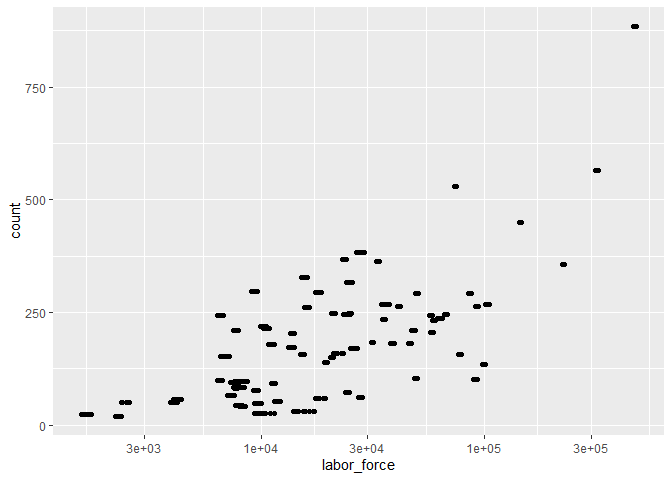

    library(blscrapeR)

    ## Warning: package 'blscrapeR' was built under R version 3.6.2

    df <- read_delim("https://www.bls.gov/web/metro/laucntycur14.txt", delim = "|", skip = 6)

    ## Parsed with column specification:
    ## cols(
    ##   ` CN0100100000000 ` = col_character(),
    ##   `  01  ` = col_character(),
    ##   `  001  ` = col_character(),
    ##   ` Autauga County, AL                       ` = col_character(),
    ##   `   Nov-18  ` = col_character(),
    ##   `     25,875 ` = col_character(),
    ##   `     25,047 ` = col_character(),
    ##   `      828 ` = col_character(),
    ##   `     3.2` = col_character()
    ## )

    ## Warning: 4 parsing failures.
    ##   row col  expected    actual                                             file
    ## 45066  -- 9 columns 1 columns 'https://www.bls.gov/web/metro/laucntycur14.txt'
    ## 45067  -- 9 columns 1 columns 'https://www.bls.gov/web/metro/laucntycur14.txt'
    ## 45068  -- 9 columns 1 columns 'https://www.bls.gov/web/metro/laucntycur14.txt'
    ## 45069  -- 9 columns 1 columns 'https://www.bls.gov/web/metro/laucntycur14.txt'

    colnames(df)

    ## [1] " CN0100100000000 "                         
    ## [2] "  01  "                                    
    ## [3] "  001  "                                   
    ## [4] " Autauga County, AL                       "
    ## [5] "   Nov-18  "                               
    ## [6] "     25,875 "                              
    ## [7] "     25,047 "                              
    ## [8] "      828 "                                
    ## [9] "     3.2"

    df

    ## # A tibble: 45,069 x 9
    ##    ` CN01001000000~ `  01  ` `  001  ` ` Autauga Count~ `   Nov-18  `
    ##    <chr>            <chr>    <chr>     <chr>            <chr>        
    ##  1 " CN01003000000~ "  01  " "  003  " " Baldwin Count~ "   Nov-18  "
    ##  2 " CN01005000000~ "  01  " "  005  " " Barbour Count~ "   Nov-18  "
    ##  3 " CN01007000000~ "  01  " "  007  " " Bibb County, ~ "   Nov-18  "
    ##  4 " CN01009000000~ "  01  " "  009  " " Blount County~ "   Nov-18  "
    ##  5 " CN01011000000~ "  01  " "  011  " " Bullock Count~ "   Nov-18  "
    ##  6 " CN01013000000~ "  01  " "  013  " " Butler County~ "   Nov-18  "
    ##  7 " CN01015000000~ "  01  " "  015  " " Calhoun Count~ "   Nov-18  "
    ##  8 " CN01017000000~ "  01  " "  017  " " Chambers Coun~ "   Nov-18  "
    ##  9 " CN01019000000~ "  01  " "  019  " " Cherokee Coun~ "   Nov-18  "
    ## 10 " CN01021000000~ "  01  " "  021  " " Chilton Count~ "   Nov-18  "
    ## # ... with 45,059 more rows, and 4 more variables: ` 25,875 ` <chr>, ` 25,047
    ## #   ` <chr>, ` 828 ` <chr>, ` 3.2` <chr>

    table = data.frame()
    table <- rbind(table, df[1:45069,])
    table <- rbind(colnames(df), table)
    table

    ## # A tibble: 45,070 x 9
    ##    ` CN01001000000~ `  01  ` `  001  ` ` Autauga Count~ `   Nov-18  `
    ##    <chr>            <chr>    <chr>     <chr>            <chr>        
    ##  1 " CN01001000000~ "  01  " "  001  " " Autauga Count~ "   Nov-18  "
    ##  2 " CN01003000000~ "  01  " "  003  " " Baldwin Count~ "   Nov-18  "
    ##  3 " CN01005000000~ "  01  " "  005  " " Barbour Count~ "   Nov-18  "
    ##  4 " CN01007000000~ "  01  " "  007  " " Bibb County, ~ "   Nov-18  "
    ##  5 " CN01009000000~ "  01  " "  009  " " Blount County~ "   Nov-18  "
    ##  6 " CN01011000000~ "  01  " "  011  " " Bullock Count~ "   Nov-18  "
    ##  7 " CN01013000000~ "  01  " "  013  " " Butler County~ "   Nov-18  "
    ##  8 " CN01015000000~ "  01  " "  015  " " Calhoun Count~ "   Nov-18  "
    ##  9 " CN01017000000~ "  01  " "  017  " " Chambers Coun~ "   Nov-18  "
    ## 10 " CN01019000000~ "  01  " "  019  " " Cherokee Coun~ "   Nov-18  "
    ## # ... with 45,060 more rows, and 4 more variables: ` 25,875 ` <chr>, ` 25,047
    ## #   ` <chr>, ` 828 ` <chr>, ` 3.2` <chr>

    names(table)  = c("area code","fips_state","fips_county","area_title","Period","labor_force","Employed","Level","Rate")
    table

    ## # A tibble: 45,070 x 9
    ##    `area code` fips_state fips_county area_title Period labor_force Employed
    ##    <chr>       <chr>      <chr>       <chr>      <chr>  <chr>       <chr>   
    ##  1 " CN010010~ "  01  "   "  001  "   " Autauga~ "   N~ "     25,8~ "     2~
    ##  2 " CN010030~ "  01  "   "  003  "   " Baldwin~ "   N~ "     92,7~ "     8~
    ##  3 " CN010050~ "  01  "   "  005  "   " Barbour~ "   N~ "      8,2~ "      ~
    ##  4 " CN010070~ "  01  "   "  007  "   " Bibb Co~ "   N~ "      8,7~ "      ~
    ##  5 " CN010090~ "  01  "   "  009  "   " Blount ~ "   N~ "     25,0~ "     2~
    ##  6 " CN010110~ "  01  "   "  011  "   " Bullock~ "   N~ "      4,7~ "      ~
    ##  7 " CN010130~ "  01  "   "  013  "   " Butler ~ "   N~ "      8,8~ "      ~
    ##  8 " CN010150~ "  01  "   "  015  "   " Calhoun~ "   N~ "     45,8~ "     4~
    ##  9 " CN010170~ "  01  "   "  017  "   " Chamber~ "   N~ "     15,3~ "     1~
    ## 10 " CN010190~ "  01  "   "  019  "   " Cheroke~ "   N~ "     11,5~ "     1~
    ## # ... with 45,060 more rows, and 2 more variables: Level <chr>, Rate <chr>

    table$fips_state = as.numeric(table$fips_state)
    table$fips_county = as.numeric(table$fips_county)
    table$labor_force = as.numeric(gsub(",","", table$labor_force))
    table$Rate = as.numeric(table$Rate)
    WIunemployment = table %>% 
      filter(fips_state == 55)

    WIunemployment

    ## # A tibble: 1,008 x 9
    ##    `area code` fips_state fips_county area_title Period labor_force Employed
    ##    <chr>            <dbl>       <dbl> <chr>      <chr>        <dbl> <chr>   
    ##  1 " CN550010~         55           1 " Adams C~ "   N~        8057 "      ~
    ##  2 " CN550030~         55           3 " Ashland~ "   N~        7712 "      ~
    ##  3 " CN550050~         55           5 " Barron ~ "   N~       24756 "     2~
    ##  4 " CN550070~         55           7 " Bayfiel~ "   N~        7491 "      ~
    ##  5 " CN550090~         55           9 " Brown C~ "   N~      143763 "    14~
    ##  6 " CN550110~         55          11 " Buffalo~ "   N~        6585 "      ~
    ##  7 " CN550130~         55          13 " Burnett~ "   N~        7217 "      ~
    ##  8 " CN550150~         55          15 " Calumet~ "   N~       27691 "     2~
    ##  9 " CN550170~         55          17 " Chippew~ "   N~       33564 "     3~
    ## 10 " CN550190~         55          19 " Clark C~ "   N~       18146 "     1~
    ## # ... with 998 more rows, and 2 more variables: Level <chr>, Rate <dbl>

    bridges = read_csv("https://www.fhwa.dot.gov/bridge/nbi/2018/delimited/WI18.txt")

    ## Parsed with column specification:
    ## cols(
    ##   .default = col_double(),
    ##   STRUCTURE_NUMBER_008 = col_character(),
    ##   ROUTE_NUMBER_005D = col_character(),
    ##   HIGHWAY_DISTRICT_002 = col_character(),
    ##   COUNTY_CODE_003 = col_character(),
    ##   FEATURES_DESC_006A = col_character(),
    ##   CRITICAL_FACILITY_006B = col_logical(),
    ##   FACILITY_CARRIED_007 = col_character(),
    ##   LOCATION_009 = col_character(),
    ##   LRS_INV_ROUTE_013A = col_character(),
    ##   LAT_016 = col_character(),
    ##   LONG_017 = col_character(),
    ##   MAINTENANCE_021 = col_character(),
    ##   OWNER_022 = col_character(),
    ##   FUNCTIONAL_CLASS_026 = col_character(),
    ##   DESIGN_LOAD_031 = col_character(),
    ##   RAILINGS_036A = col_character(),
    ##   TRANSITIONS_036B = col_character(),
    ##   APPR_RAIL_036C = col_character(),
    ##   APPR_RAIL_END_036D = col_character(),
    ##   NAVIGATION_038 = col_character()
    ##   # ... with 41 more columns
    ## )

    ## See spec(...) for full column specifications.

    ## Warning: 3 parsing failures.
    ##   row                     col               expected actual                                                          file
    ##  5739 OTHR_STATE_STRUC_NO_099 no trailing characters   B010 'https://www.fhwa.dot.gov/bridge/nbi/2018/delimited/WI18.txt'
    ## 11175 OPR_RATING_METH_063     a double                 F    'https://www.fhwa.dot.gov/bridge/nbi/2018/delimited/WI18.txt'
    ## 11175 INV_RATING_METH_065     a double                 F    'https://www.fhwa.dot.gov/bridge/nbi/2018/delimited/WI18.txt'

    bridges %>% 
      group_by(COUNTY_CODE_003) %>% 
      summarize(count = n()) %>% 
      mutate(COUNTY_CODE_003 = as.numeric(COUNTY_CODE_003)) %>%
      left_join(WIunemployment,by = c("COUNTY_CODE_003" = "fips_county")) %>% 
      select(area_title, count, labor_force) %>% 
      ggplot()+
      geom_point(aes(x = labor_force, y = count)) + 
      scale_x_continuous(trans='log10')

 \#\# There
are a few features of bridges dataset which I believe could be good
predictors for the unemployment rate and level in the same county. I
choose the total number of bridges within each county in Wisconsin,
average of max span, average of sufficient rating and opr\_rating as
predictors and construct a multiple linear regression to predict the
unemployment. As suggested by the model summary, all these four
predictors are significant in predicting unemployment level and all
predictors except sufficient rating are significant in predicting
unemployment level.

    bridges %>%
      #filter(COUNTY_CODE_003 == "001") %>%
      select(MAX_SPAN_LEN_MT_048, COUNTY_CODE_003)

    ## # A tibble: 14,275 x 2
    ##    MAX_SPAN_LEN_MT_048 COUNTY_CODE_003
    ##                  <dbl> <chr>          
    ##  1                 5.5 051            
    ##  2                 7.3 051            
    ##  3                 6.1 115            
    ##  4                20.4 115            
    ##  5                 7.6 003            
    ##  6                 9.1 003            
    ##  7                 8.8 003            
    ##  8                19.5 115            
    ##  9                13.4 003            
    ## 10                15.2 003            
    ## # ... with 14,265 more rows

    table(bridges$COUNTY_CODE_003)

    ## 
    ## 001 003 005 007 009 011 013 015 017 019 021 023 025 027 029 031 033 035 037 039 
    ##  41  83 317  95 449 242  66  61 363 294 183 209 566 210  31 158 246 233  20 244 
    ## 041 043 045 047 049 051 053 055 057 059 061 063 065 067 069 071 073 075 077 078 
    ##  50 383 247  48 203  49 215 181 172 100  92 246 218  77 156 264 529 139  81  24 
    ## 079 081 083 085 087 089 091 093 095 097 099 101 103 105 107 109 111 113 115 117 
    ## 884 368 149  58 267 103  57 248  72 182  99 134 297 293 151 293 268  97 158 237 
    ## 119 121 123 125 127 129 131 133 135 137 139 141 
    ## 178 260 328  26 206  43 157 357 169  52 264 235

    # add 4 predictors
    total_bridges_join <- bridges %>% 
      group_by(COUNTY_CODE_003) %>% 
      summarize(number_of_bridges = n(), mean_max_span = mean(MAX_SPAN_LEN_MT_048), sufficient_rating = mean(SUFFICIENCY_RATING), opr_rating = mean(OPR_RATING_METH_063)) %>%
      mutate(COUNTY_CODE_003 = as.numeric(COUNTY_CODE_003)) %>%
      left_join(WIunemployment,by = c("COUNTY_CODE_003" = "fips_county")) %>%
      mutate(Level = as.numeric(Level))

    ## Warning: 强制改变过程中产生了NA

    # sum(is.na(total_bridges_join$Level))
    # sum(is.na(total_bridges_join$number_of_bridges))
    # sum(is.na(total_bridges_join$mean_max_span))
    # sum(is.na(total_bridges_join$sufficient_rating))
    # sum(is.na(total_bridges_join$opr_rating))
    # add second predictors: average of max span in each county

    level <- lm(Level ~ number_of_bridges + mean_max_span + sufficient_rating + opr_rating , data = total_bridges_join)

    Rate <- lm(Rate ~ number_of_bridges + mean_max_span + sufficient_rating + opr_rating , data = total_bridges_join)

    summary(level)

    ## 
    ## Call:
    ## lm(formula = Level ~ number_of_bridges + mean_max_span + sufficient_rating + 
    ##     opr_rating, data = total_bridges_join)
    ## 
    ## Residuals:
    ##     Min      1Q  Median      3Q     Max 
    ## -368.19 -153.12   -5.84  135.35  534.66 
    ## 
    ## Coefficients:
    ##                    Estimate Std. Error t value Pr(>|t|)    
    ## (Intercept)        744.3720   224.3502   3.318 0.000959 ***
    ## number_of_bridges    1.0938     0.0813  13.454  < 2e-16 ***
    ## mean_max_span       28.9076     2.5205  11.469  < 2e-16 ***
    ## sufficient_rating   -8.0192     2.5472  -3.148 0.001719 ** 
    ## opr_rating        -136.5797    26.9326  -5.071  5.2e-07 ***
    ## ---
    ## Signif. codes:  0 '***' 0.001 '**' 0.01 '*' 0.05 '.' 0.1 ' ' 1
    ## 
    ## Residual standard error: 192.9 on 635 degrees of freedom
    ##   (368 observations deleted due to missingness)
    ## Multiple R-squared:  0.3298, Adjusted R-squared:  0.3255 
    ## F-statistic: 78.11 on 4 and 635 DF,  p-value: < 2.2e-16

    summary(Rate)

    ## 
    ## Call:
    ## lm(formula = Rate ~ number_of_bridges + mean_max_span + sufficient_rating + 
    ##     opr_rating, data = total_bridges_join)
    ## 
    ## Residuals:
    ##     Min      1Q  Median      3Q     Max 
    ## -1.5112 -0.6416 -0.2273  0.4089  9.6170 
    ## 
    ## Coefficients:
    ##                     Estimate Std. Error t value Pr(>|t|)    
    ## (Intercept)        3.1162290  0.9986230   3.121  0.00186 ** 
    ## number_of_bridges -0.0028946  0.0002348 -12.326  < 2e-16 ***
    ## mean_max_span     -0.0311251  0.0094518  -3.293  0.00103 ** 
    ## sufficient_rating  0.0056877  0.0116476   0.488  0.62543    
    ## opr_rating         0.6832652  0.1055670   6.472 1.52e-10 ***
    ## ---
    ## Signif. codes:  0 '***' 0.001 '**' 0.01 '*' 0.05 '.' 0.1 ' ' 1
    ## 
    ## Residual standard error: 0.9812 on 989 degrees of freedom
    ##   (14 observations deleted due to missingness)
    ## Multiple R-squared:  0.165,  Adjusted R-squared:  0.1617 
    ## F-statistic: 48.87 on 4 and 989 DF,  p-value: < 2.2e-16

    # table(bridges$INVENTORY_RATING_066)

    library(lubridate)

    ## 
    ## Attaching package: 'lubridate'

    ## The following object is masked from 'package:base':
    ## 
    ##     date

    library(zoo)

    ## Warning: package 'zoo' was built under R version 3.6.2

    ## 
    ## Attaching package: 'zoo'

    ## The following objects are masked from 'package:base':
    ## 
    ##     as.Date, as.Date.numeric

    with_pre <- total_bridges_join %>%
      mutate(pre =lag(Period), pre_rate = lag(Rate), pre_level = lag(Level)) %>%
      drop_na(pre)

    with_pre

    ## # A tibble: 1,007 x 16
    ##    COUNTY_CODE_003 number_of_bridg~ mean_max_span sufficient_rati~ opr_rating
    ##              <dbl>            <int>         <dbl>            <dbl>      <dbl>
    ##  1               1               41          11.7             91.2       1.41
    ##  2               1               41          11.7             91.2       1.41
    ##  3               1               41          11.7             91.2       1.41
    ##  4               1               41          11.7             91.2       1.41
    ##  5               1               41          11.7             91.2       1.41
    ##  6               1               41          11.7             91.2       1.41
    ##  7               1               41          11.7             91.2       1.41
    ##  8               1               41          11.7             91.2       1.41
    ##  9               1               41          11.7             91.2       1.41
    ## 10               1               41          11.7             91.2       1.41
    ## # ... with 997 more rows, and 11 more variables: `area code` <chr>,
    ## #   fips_state <dbl>, area_title <chr>, Period <chr>, labor_force <dbl>,
    ## #   Employed <chr>, Level <dbl>, Rate <dbl>, pre <chr>, pre_rate <dbl>,
    ## #   pre_level <dbl>

After adding the unemployment level and rate from previous month, I found the accuracy of model increase dramatically indicated by R-square. Moreover, some predictors used to be siginificant in the model without previous unemployment level and rate become insignificant after adding two new parameters, such as opr\_rating and sufficient\_rating. Therefore, I suspect there might be a strong collinearity between unemployment level and opr\_rating, which might be the cause of huge change in the p-value.
------------------------------------------------------------------------------------------------------------------------------------------------------------------------------------------------------------------------------------------------------------------------------------------------------------------------------------------------------------------------------------------------------------------------------------------------------------------------------------------------------------------------

    pre_Rate <- lm(Rate ~ number_of_bridges + mean_max_span + sufficient_rating + opr_rating + pre_rate , data = with_pre)
    summary(pre_Rate)

    ## 
    ## Call:
    ## lm(formula = Rate ~ number_of_bridges + mean_max_span + sufficient_rating + 
    ##     opr_rating + pre_rate, data = with_pre)
    ## 
    ## Residuals:
    ##     Min      1Q  Median      3Q     Max 
    ## -3.2579 -0.3722 -0.0610  0.3813  5.3483 
    ## 
    ## Coefficients:
    ##                     Estimate Std. Error t value Pr(>|t|)    
    ## (Intercept)        1.2012343  0.7293813   1.647 0.099892 .  
    ## number_of_bridges -0.0012655  0.0001791  -7.064 3.05e-12 ***
    ## mean_max_span     -0.0143161  0.0068914  -2.077 0.038024 *  
    ## sufficient_rating  0.0004956  0.0084792   0.058 0.953405    
    ## opr_rating         0.2816297  0.0778559   3.617 0.000313 ***
    ## pre_rate           0.6691238  0.0224325  29.828  < 2e-16 ***
    ## ---
    ## Signif. codes:  0 '***' 0.001 '**' 0.01 '*' 0.05 '.' 0.1 ' ' 1
    ## 
    ## Residual standard error: 0.7122 on 987 degrees of freedom
    ##   (14 observations deleted due to missingness)
    ## Multiple R-squared:  0.5608, Adjusted R-squared:  0.5586 
    ## F-statistic: 252.1 on 5 and 987 DF,  p-value: < 2.2e-16

    pre_Level <- lm(Level ~ number_of_bridges + mean_max_span + sufficient_rating + opr_rating + pre_level + pre_rate , data = with_pre)

    summary(pre_Level)

    ## 
    ## Call:
    ## lm(formula = Level ~ number_of_bridges + mean_max_span + sufficient_rating + 
    ##     opr_rating + pre_level + pre_rate, data = with_pre)
    ## 
    ## Residuals:
    ##     Min      1Q  Median      3Q     Max 
    ## -685.51  -58.36   -5.87   45.40  443.92 
    ## 
    ## Coefficients:
    ##                    Estimate Std. Error t value Pr(>|t|)    
    ## (Intercept)       118.72917  119.46373   0.994  0.32070    
    ## number_of_bridges   0.16434    0.05133   3.202  0.00144 ** 
    ## mean_max_span       5.88512    1.45715   4.039 6.08e-05 ***
    ## sufficient_rating  -0.65045    1.35478  -0.480  0.63132    
    ## opr_rating        -18.46918   14.93701  -1.236  0.21677    
    ## pre_level           0.82635    0.02118  39.016  < 2e-16 ***
    ## pre_rate          -16.95369    3.80163  -4.460 9.82e-06 ***
    ## ---
    ## Signif. codes:  0 '***' 0.001 '**' 0.01 '*' 0.05 '.' 0.1 ' ' 1
    ## 
    ## Residual standard error: 99.1 on 596 degrees of freedom
    ##   (404 observations deleted due to missingness)
    ## Multiple R-squared:  0.8104, Adjusted R-squared:  0.8085 
    ## F-statistic: 424.5 on 6 and 596 DF,  p-value: < 2.2e-16

    colnames(bridges)

    ##   [1] "STATE_CODE_001"          "STRUCTURE_NUMBER_008"   
    ##   [3] "RECORD_TYPE_005A"        "ROUTE_PREFIX_005B"      
    ##   [5] "SERVICE_LEVEL_005C"      "ROUTE_NUMBER_005D"      
    ##   [7] "DIRECTION_005E"          "HIGHWAY_DISTRICT_002"   
    ##   [9] "COUNTY_CODE_003"         "PLACE_CODE_004"         
    ##  [11] "FEATURES_DESC_006A"      "CRITICAL_FACILITY_006B" 
    ##  [13] "FACILITY_CARRIED_007"    "LOCATION_009"           
    ##  [15] "MIN_VERT_CLR_010"        "KILOPOINT_011"          
    ##  [17] "BASE_HWY_NETWORK_012"    "LRS_INV_ROUTE_013A"     
    ##  [19] "SUBROUTE_NO_013B"        "LAT_016"                
    ##  [21] "LONG_017"                "DETOUR_KILOS_019"       
    ##  [23] "TOLL_020"                "MAINTENANCE_021"        
    ##  [25] "OWNER_022"               "FUNCTIONAL_CLASS_026"   
    ##  [27] "YEAR_BUILT_027"          "TRAFFIC_LANES_ON_028A"  
    ##  [29] "TRAFFIC_LANES_UND_028B"  "ADT_029"                
    ##  [31] "YEAR_ADT_030"            "DESIGN_LOAD_031"        
    ##  [33] "APPR_WIDTH_MT_032"       "MEDIAN_CODE_033"        
    ##  [35] "DEGREES_SKEW_034"        "STRUCTURE_FLARED_035"   
    ##  [37] "RAILINGS_036A"           "TRANSITIONS_036B"       
    ##  [39] "APPR_RAIL_036C"          "APPR_RAIL_END_036D"     
    ##  [41] "HISTORY_037"             "NAVIGATION_038"         
    ##  [43] "NAV_VERT_CLR_MT_039"     "NAV_HORR_CLR_MT_040"    
    ##  [45] "OPEN_CLOSED_POSTED_041"  "SERVICE_ON_042A"        
    ##  [47] "SERVICE_UND_042B"        "STRUCTURE_KIND_043A"    
    ##  [49] "STRUCTURE_TYPE_043B"     "APPR_KIND_044A"         
    ##  [51] "APPR_TYPE_044B"          "MAIN_UNIT_SPANS_045"    
    ##  [53] "APPR_SPANS_046"          "HORR_CLR_MT_047"        
    ##  [55] "MAX_SPAN_LEN_MT_048"     "STRUCTURE_LEN_MT_049"   
    ##  [57] "LEFT_CURB_MT_050A"       "RIGHT_CURB_MT_050B"     
    ##  [59] "ROADWAY_WIDTH_MT_051"    "DECK_WIDTH_MT_052"      
    ##  [61] "VERT_CLR_OVER_MT_053"    "VERT_CLR_UND_REF_054A"  
    ##  [63] "VERT_CLR_UND_054B"       "LAT_UND_REF_055A"       
    ##  [65] "LAT_UND_MT_055B"         "LEFT_LAT_UND_MT_056"    
    ##  [67] "DECK_COND_058"           "SUPERSTRUCTURE_COND_059"
    ##  [69] "SUBSTRUCTURE_COND_060"   "CHANNEL_COND_061"       
    ##  [71] "CULVERT_COND_062"        "OPR_RATING_METH_063"    
    ##  [73] "OPERATING_RATING_064"    "INV_RATING_METH_065"    
    ##  [75] "INVENTORY_RATING_066"    "STRUCTURAL_EVAL_067"    
    ##  [77] "DECK_GEOMETRY_EVAL_068"  "UNDCLRENCE_EVAL_069"    
    ##  [79] "POSTING_EVAL_070"        "WATERWAY_EVAL_071"      
    ##  [81] "APPR_ROAD_EVAL_072"      "WORK_PROPOSED_075A"     
    ##  [83] "WORK_DONE_BY_075B"       "IMP_LEN_MT_076"         
    ##  [85] "DATE_OF_INSPECT_090"     "INSPECT_FREQ_MONTHS_091"
    ##  [87] "FRACTURE_092A"           "UNDWATER_LOOK_SEE_092B" 
    ##  [89] "SPEC_INSPECT_092C"       "FRACTURE_LAST_DATE_093A"
    ##  [91] "UNDWATER_LAST_DATE_093B" "SPEC_LAST_DATE_093C"    
    ##  [93] "BRIDGE_IMP_COST_094"     "ROADWAY_IMP_COST_095"   
    ##  [95] "TOTAL_IMP_COST_096"      "YEAR_OF_IMP_097"        
    ##  [97] "OTHER_STATE_CODE_098A"   "OTHER_STATE_PCNT_098B"  
    ##  [99] "OTHR_STATE_STRUC_NO_099" "STRAHNET_HIGHWAY_100"   
    ## [101] "PARALLEL_STRUCTURE_101"  "TRAFFIC_DIRECTION_102"  
    ## [103] "TEMP_STRUCTURE_103"      "HIGHWAY_SYSTEM_104"     
    ## [105] "FEDERAL_LANDS_105"       "YEAR_RECONSTRUCTED_106" 
    ## [107] "DECK_STRUCTURE_TYPE_107" "SURFACE_TYPE_108A"      
    ## [109] "MEMBRANE_TYPE_108B"      "DECK_PROTECTION_108C"   
    ## [111] "PERCENT_ADT_TRUCK_109"   "NATIONAL_NETWORK_110"   
    ## [113] "PIER_PROTECTION_111"     "BRIDGE_LEN_IND_112"     
    ## [115] "SCOUR_CRITICAL_113"      "FUTURE_ADT_114"         
    ## [117] "YEAR_OF_FUTURE_ADT_115"  "MIN_NAV_CLR_MT_116"     
    ## [119] "FED_AGENCY"              "DATE_LAST_UPDATE"       
    ## [121] "TYPE_LAST_UPDATE"        "DEDUCT_CODE"            
    ## [123] "REMARKS"                 "PROGRAM_CODE"           
    ## [125] "PROJ_NO"                 "PROJ_SUFFIX"            
    ## [127] "NBI_TYPE_OF_IMP"         "DTL_TYPE_OF_IMP"        
    ## [129] "SPECIAL_CODE"            "STEP_CODE"              
    ## [131] "STATUS_WITH_10YR_RULE"   "SUFFICIENCY_ASTERC"     
    ## [133] "SUFFICIENCY_RATING"      "STATUS_NO_10YR_RULE"    
    ## [135] "CAT10"                   "CAT23"                  
    ## [137] "CAT29"

    # state = list("CA", "MI","WI")
    # yearr = list(10,11,12,13, 14,15,16,17,18)
    # yearr[1]
    # for ( i in 1:3){
    #   for (j in 1:2){
    #     name = paste(state[i], yearr[j], sep = "")
    #     print(name)
    #     a = paste0("https://www.fhwa.dot.gov/bridge/nbi/20" ,yearr[j], "/delimited/", state[i], yearr[j], ".txt", sep = "")
    #     print(a)
    #     assign(name, read_csv(a))
    #     
    #     
    #     
    #   }
    # }
    # 
    # WI10 %>% 
    #       group_by(COUNTY_CODE_003) %>% 
    #       summarize(count = n()) %>% 
    #       mutate(COUNTY_CODE_003 = as.numeric(COUNTY_CODE_003)) %>%
    #       left_join(WIunemployment,by = c("COUNTY_CODE_003" = "fips_county")) %>% 
    #       select(area_title, count, Rate) %>% 
    #       ggplot()+
    #       geom_point(aes(x = Rate, y = count)) + 
    #       scale_x_continuous()
    # 
    # WI11 %>% 
    #       group_by(COUNTY_CODE_003) %>% 
    #       summarize(count = n()) %>% 
    #       mutate(COUNTY_CODE_003 = as.numeric(COUNTY_CODE_003)) %>%
    #       left_join(WIunemployment,by = c("COUNTY_CODE_003" = "fips_county")) %>% 
    #       select(area_title, count, Rate) %>% 
    #       group_by(area_title) %>%
    #       summarise(n = n(), mean_rate = mean(Rate))
    #   
    #   
    #       ggplot()+
    #       geom_point(aes(x = Rate, y = count)) + 
    #       scale_x_continuous()
    # 
    # colnames(WI11)
    # 
    # WI10 %>%
    #   select(COUNTY_CODE_003) %>% 
    #   count(COUNTY_CODE_003)
    #   
    # #read_csv("https://www.fhwa.dot.gov/bridge/nbi/2010/delimited/CA10.txt")
    # 14*72
